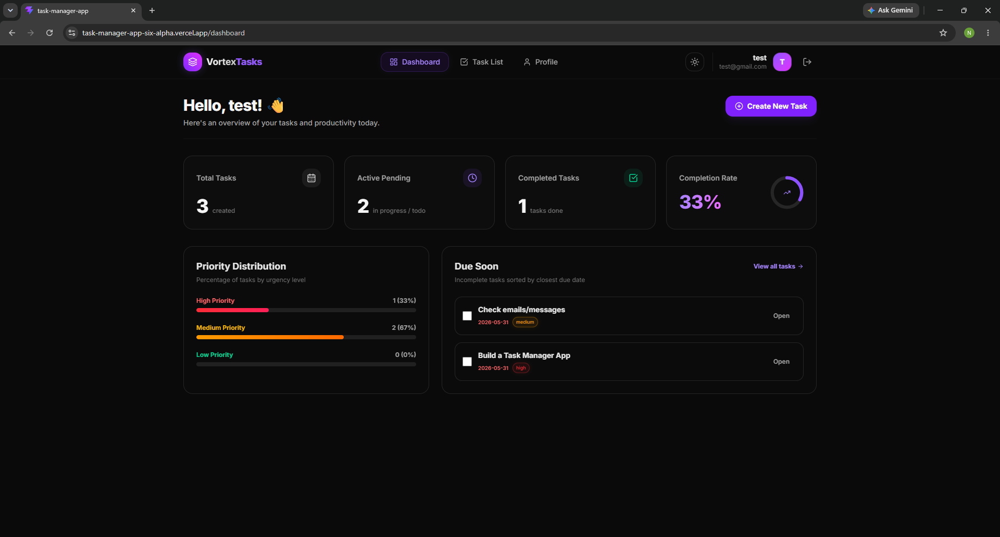
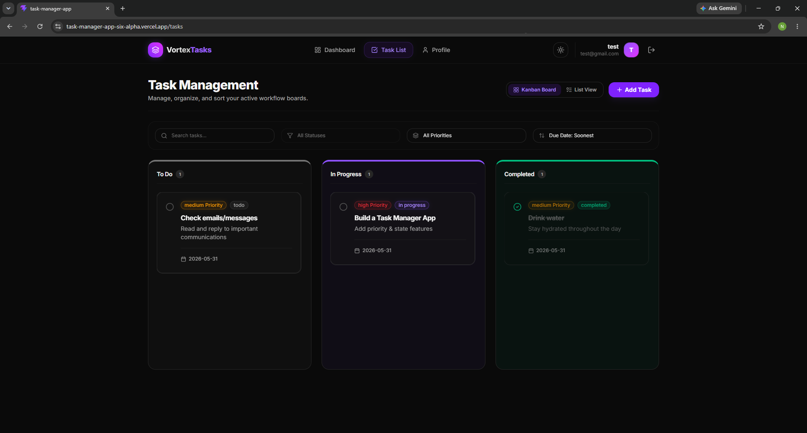
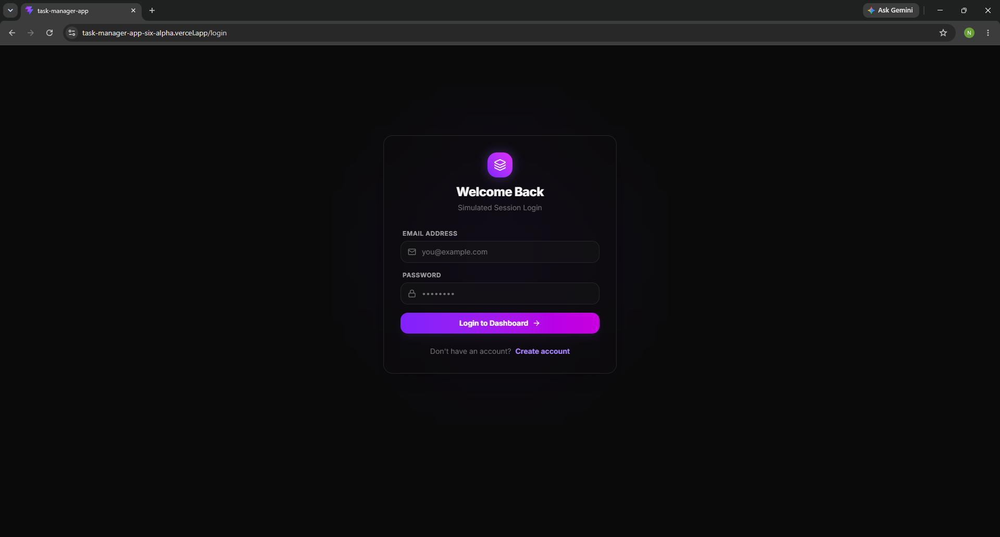

# VortexTasks - Premium Task Manager

VortexTasks is a premium, high-fidelity task management application designed to streamline personal workflows and increase daily productivity. It features a stunning glassmorphic user interface, fully responsive views including an interactive mobile Kanban board, and client-side database persistence.

## 🚀 Tech Stack

- **Core Framework**: React 18 + Vite (ESM support)
- **Styling & Theme**: Tailwind CSS v4 (incorporating OKLCH fluid color tokens)
- **UI Architecture**: shadcn/ui components (Badge, Dialog, Card) + Lucide Icons
- **State & Routing**: React Context-backed custom hooks (`useAuth`, `useTasks`) + React Router DOM v7
- **Persistence**: `localStorage` (isolating sessions and task CRUD per account)

---

## 🛠️ Local Setup

Follow these simple steps to run the project locally on your machine:

### 1. Install Dependencies
Navigate to your project root folder in the terminal and install the required packages:
```bash
npm install
```

### 2. Run the Development Server
Launch Vite's hot-reloading development server:
```bash
npm run dev
```
Open your browser and navigate to the address shown in the terminal (usually `http://localhost:5173`).

### 3. Build for Production (Optional)
Generate an optimized production bundle inside the `dist` folder:
```bash
npm run build
```

---

## 📸 Working UI Screenshots

Here are the placeholders for the screenshots of the working user interface (add your files inside `public/screenshots/` to display them here):

### 1. Dashboard Page

*Displays high-level productivity stats, an interactive completion circular progress widget, priority distributions, and due-soon lists.*

### 2. Kanban Board View

*Interactive task board showing To Do, In Progress, and Completed columns with horizontal swipe gestures on mobile viewports.*

### 3. Login Page

*A sleek, glassmorphic entry form with validation alerts and ambient glowing accents.*
